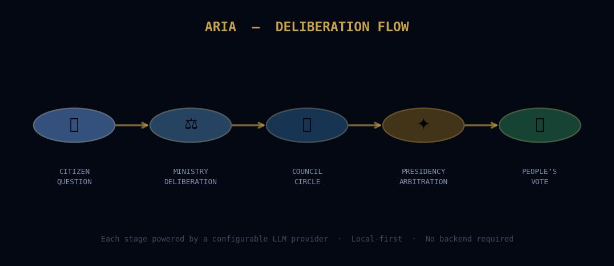
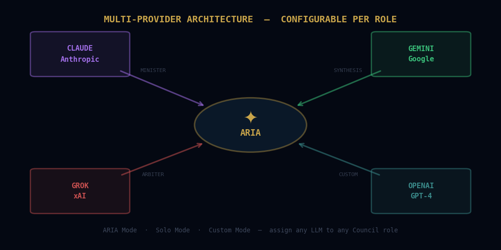
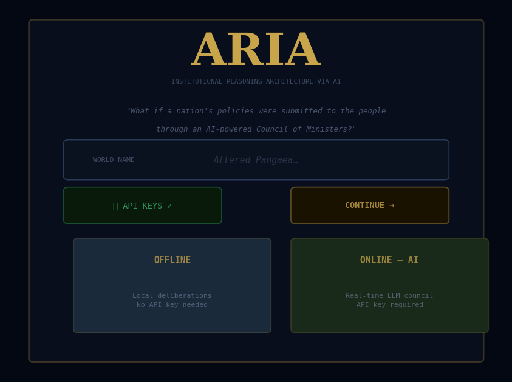

<div align="center">

```
 ██████╗    ██████╗   ██╗    ██████╗
██╔══██╗   ██╔══██╗  ██║   ██╔══██╗
███████║   ██████╔╝  ██║   ███████║
██╔══██║   ██╔══██╗  ██║   ██╔══██║
██║  ██║   ██║  ██║  ██║   ██║  ██║
╚═╝  ╚═╝   ╚═╝  ╚═╝  ╚═╝   ╚═╝  ╚═╝
```

**Architecture de Raisonnement Institutionnel par l'IA**

*« Et si les politiques d'un pays étaient soumises au peuple<br>par l'intermédiaire d'un conseil des ministres IA ? »*

[](https://github.com/flodus/aria-llm-council)
[](https://react.dev)
[](https://vitejs.dev)
[](LICENSE)
[](https://flodus.github.io/aria-llm-council)

**[🚀 Lancer la démo](https://flodus.github.io/aria-llm-council)** &nbsp;·&nbsp; **[🇬🇧 English version](README.md)**

</div>

---

## Vue d'ensemble

ARIA est une **simulation de gouvernance systémique**. Le joueur incarne le peuple souverain face à un Conseil des Ministres incarné par différents Grands Modèles de Langage. À chaque cycle, votre question traverse une chaîne délibérative complète — du débat ministériel à la synthèse présidentielle — avant que vos citoyens votent.

C'est un **bac à sable politique** et une expérience de pensée interactive sur la gouvernance algorithmique et la co-décision humain-IA.



---

## Inspiration

> L'orchestration d'agents d'ARIA est une extension géopolitique et interactive du projet **[llm-council d'Andrej Karpathy](https://github.com/karpathy/llm-council)**. Là où le projet original explore la délibération multi-agents pour la résolution de problèmes logiques, ARIA applique cette architecture à la simulation à l'échelle d'une nation et à la gestion de crises politiques — transformant la salle du conseil en monde jouable.

---

## Comment ça fonctionne


Chaque cycle de gouvernance suit un pipeline délibératif fixe :

| Étape | Rôle | Piloté par |
|-------|------|------------|
| **Question** | Le joueur soumet une question de politique publique | Humain |
| **Délibération ministérielle** | Chaque ministre argumente depuis son archétype | LLM (configurable) |
| **Synthèse du conseil** | Les positions ministérielles sont résumées | LLM (configurable) |
| **Phare / Boussole** | Deux figures présidentielles arbitrent | LLM (configurable) |
| **Décision présidentielle** | Une recommandation finale est rédigée | LLM (configurable) |
| **Vote populaire** | Les citoyens votent — la satisfaction évolue | Moteur de simulation |

---

## Architecture multi-providers



ARIA propose **trois modes de fonctionnement IA**, configurables au démarrage :

| Mode | Description |
|------|-------------|
| **ARIA** | Orchestration multi-providers — assignez différents LLMs par étape de délibération |
| **SOLO** | Un seul provider gère tous les rôles — plus simple, voix cohérente |
| **PERSONNALISÉ** | Assignation rôle par rôle sur 7 fonctions du conseil |

### Providers supportés

| Provider | Modèles |
|----------|---------|
| **Claude** (Anthropic) | `claude-opus-4-6` · `claude-sonnet-4-6` · `claude-haiku-4-5` |
| **Gemini** (Google) | `gemini-2.0-flash` · `gemini-1.5-pro` · `gemini-1.5-flash` |
| **Grok** (xAI) | `grok-3` · `grok-3-mini` |
| **GPT** (OpenAI) | `gpt-4.1` · `gpt-4.1-mini` |

Toutes les clés sont stockées **localement** dans le `localStorage`. Aucun backend, aucune collecte de données.

---

## Fonctionnalités principales

<table>
<tr>
<td width="50%">

### 🌍 Moteur de monde procédural
- Globe low-poly SVG avec PRNG personnalisé
- 1 à 6 nations simultanées
- Pays réels (avec données géopolitiques 2025–2026) ou entièrement fictifs
- Types de terrain : côtier · continental · montagneux · île · archipel

### 🏛 Conseil des Ministres IA
- 12 ministres répartis en 7 ministères
- Chaque ministre possède un prompt d'archétype qui façonne sa vision
- Le Phare (vision) et la Boussole (mémoire) comme figures présidentielles
- Éditeur constitutionnel — changer régime, dirigeant, prompts ministériels en cours de partie

</td>
<td width="50%">

### 📜 Journal Chronolog
- Historique typé complet : votes · sécessions · constitutions · nouvelles nations
- Snapshots de cycle avec deltas de satisfaction et d'acceptation ARIA
- Auto-résumé des cycles anciens pour gérer le contexte
- Persistance entre sessions via localStorage

### ⚖️ Événements mondiaux
- **Sécession** : diviser une nation en deux, avec transfert de population
- **Nouveau pays** : ajouter des nations en cours de simulation
- **Réforme constitutionnelle** : refondre régime et leadership
- **Satisfaction / Score ARIA** : métriques dynamiques par nation

</td>
</tr>
</table>

---

## Démarrage rapide

### Prérequis

- Node.js ≥ 18
- Au moins une clé API (Claude, Gemini, Grok ou OpenAI)

### Installation

```bash
git clone https://github.com/flodus/aria-llm-council.git
cd aria-llm-council
npm install
npm run dev
```

Ouvrez `http://localhost:5173` — l'écran d'initialisation vous guide à travers la configuration du monde et des clés API.

### Première session



1. **Nommez votre monde** — c'est le conteneur de la simulation
2. **Saisissez vos clés API** — testez-les en ligne, seules les clés validées sont sauvegardées
3. **Choisissez votre mode IA** — ARIA / Solo / Personnalisé, assignez les LLMs par rôle
4. **Configurez vos nations** — pays réel ou fictif, 1 à 6 nations
5. **Gouvernez** — soumettez des questions, regardez le conseil délibérer, votez

---

## Structure du projet

```
aria-llm-council/
├── src/
│   ├── App.jsx                 # Racine — routage entre les écrans
│   ├── InitScreen.jsx          # Onboarding — config du monde et des API
│   ├── Dashboard_p1.jsx        # Moteur principal — appels LLM, état du jeu
│   ├── Dashboard_p3.jsx        # Gestionnaires d'événements — votes, sécession, constitution
│   ├── LLMCouncil.jsx          # Interface de délibération du conseil
│   ├── llmCouncilEngine.js     # Logique du pipeline de délibération
│   ├── ChronologView.jsx       # Journal d'historique
│   ├── useChronolog.js         # Hook Chronolog — stockage des événements
│   ├── ConstitutionModal.jsx   # Éditeur constitutionnel
│   ├── CountryPanel.jsx        # Panneau de stats par nation
│   ├── ariaData.js             # Dataset des pays réels
│   └── ariaTheme.js            # Tokens du design system
├── templates/
│   ├── base_agents.json        # Archétypes et prompts des ministres
│   └── base_stats.json         # Templates d'initialisation des nations
└── doc/                        # Assets du README
```

---

## Notes d'architecture

**Local-first par conception.** Chaque appel API est effectué directement depuis le navigateur vers le provider LLM. Aucun proxy, aucun serveur, aucun compte. Vos clés API ne quittent jamais votre machine.

**Sessions sans état serveur.** L'état de la simulation vit en mémoire React et est sérialisé dans le `localStorage` pour la persistance. Chaque appel LLM reçoit l'intégralité du contexte pertinent — il n'y a pas de mémoire de session côté provider.

**Délibération modulaire.** Le pipeline du conseil dans `llmCouncilEngine.js` est entièrement composable. Ajouter une nouvelle étape de délibération ou changer de provider ne nécessite qu'une nouvelle entrée dans la config du moteur et une option dans `Settings.jsx`.

---

## Feuille de route

Voir [ROADMAP.md](ROADMAP.md) pour la feuille de route complète.

**À venir :**
- [ ] Carte du monde interactive (globe low-poly WebGL)
- [ ] Support i18n (switch FR/EN au démarrage)
- [ ] Mode multijoueur (monde partagé, chaque joueur gouverne une nation)
- [ ] Export / import des sauvegardes
- [ ] Registre de modèles dynamique (modèles disponibles via JSON distant)

---

## Contribution

Les issues et PRs sont les bienvenus. Si vous forkez ou construisez à partir d'ARIA, une mention est appréciée.

Si vous êtes **Andrej Karpathy** — merci pour llm-council. Ce projet n'existerait pas sans lui.

---

## Licence

MIT — voir [LICENSE](LICENSE)

---

<div align="center">

*Construit avec Claude Sonnet · Gemini Flash · Grok-3 · GPT-4.1*

*et beaucoup de crises constitutionnelles*

</div>
