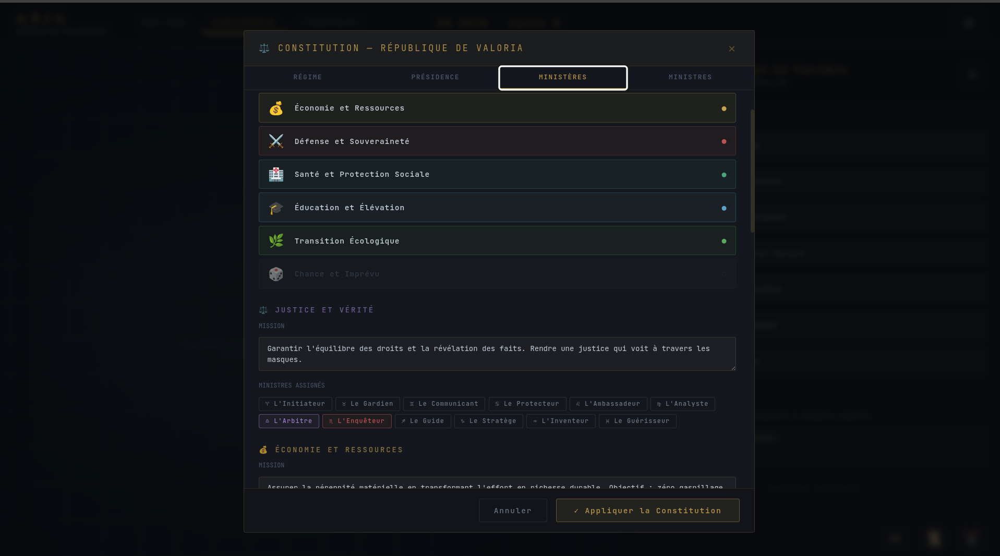
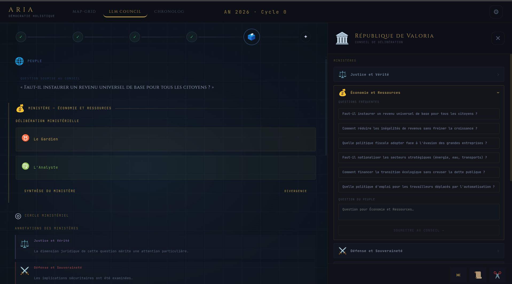
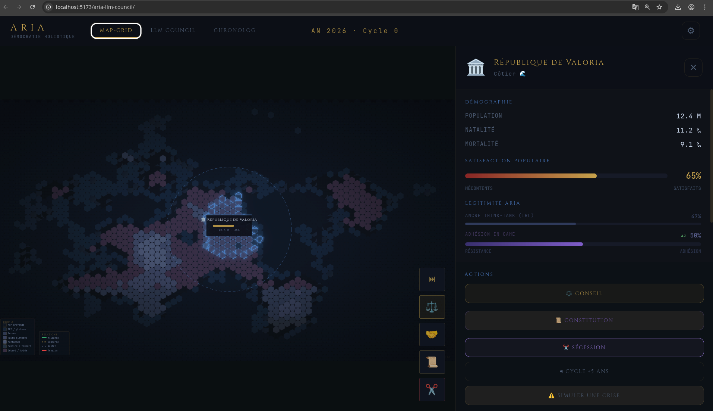
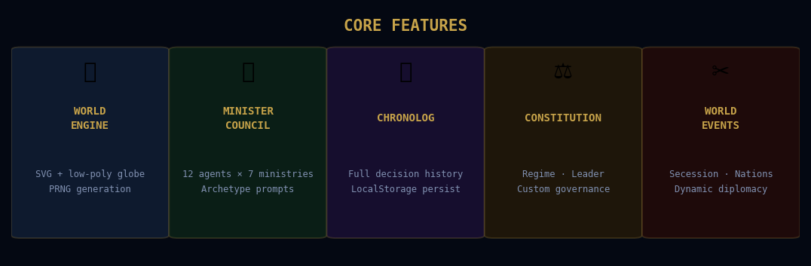

<div align="center">

```
 ██████╗    ██████╗   ██╗    ██████╗
██╔══██╗   ██╔══██╗  ██║   ██╔══██╗
███████║   ██████╔╝  ██║   ███████║
██╔══██║   ██╔══██╗  ██║   ██╔══██║
██║  ██║   ██║  ██║  ██║   ██║  ██║
╚═╝  ╚═╝   ╚═╝  ╚═╝  ╚═╝   ╚═╝  ╚═╝
```

**Institutional Reasoning Architecture via AI**

*"What if a nation's policies were submitted to the people<br>through an AI-powered Council of Ministers?"*

[](https://github.com/flodus/aria-llm-council)
[](https://react.dev)
[](https://vitejs.dev)
[](LICENSE)
[](https://flodus.github.io/aria-llm-council)

**[🚀 Launch Demo](https://flodus.github.io/aria-llm-council)** &nbsp;·&nbsp; **[🇫🇷 Version Française](README.fr.md)**

</div>

---

## Overview

ARIA is a **systemic governance simulation**. You play as the sovereign people, facing a Council of Ministers embodied by different Large Language Models. Each cycle, your question travels through a full deliberative chain — from ministerial debate to presidential synthesis — before your citizens vote.

It is a **political sandbox** and an interactive thought experiment on algorithmic governance and human-AI co-decision making.


| Constitutional Setup | Council Deliberation | Geopolitical Map |
| :---: | :---: | :---: |
|  |  |  |

*[View full screenshot gallery →](doc/screenshots/)*

---

## Inspiration

> ARIA's agent orchestration is a geopolitical and interactive extension of **[Andrej Karpathy's llm-council](https://github.com/karpathy/llm-council)**. Where the original project explores multi-agent deliberation for logical problem-solving, ARIA applies this architecture to nation-scale simulation and political crisis management — turning the council chamber into a playable world.

---

## How It Works



Each governance cycle follows a fixed deliberative pipeline:

| Stage | Role | Powered by |
|-------|------|------------|
| **Question** | The player submits a policy question | Human |
| **Ministry Deliberation** | Each minister argues from their archetype | LLM (configurable) |
| **Council Synthesis** | Ministerial positions are summarized | LLM (configurable) |
| **Phare / Boussole** | Two presidential figures arbitrate | LLM (configurable) |
| **Presidential Decision** | A final recommendation is drafted | LLM (configurable) |
| **Popular Vote** | Citizens vote — satisfaction shifts | Simulation engine |

---

## Multi-Provider Architecture


ARIA ships with **three AI operating modes**, configurable at startup:

| Mode | Description |
|------|-------------|
| **ARIA** | Multi-provider orchestration — assign different LLMs per deliberation stage |
| **SOLO** | Single provider handles all roles — simpler, more coherent voice |
| **CUSTOM** | Full role-by-role assignment across 7 council functions |

### Supported Providers

| Provider | Models |
|----------|--------|
| **Claude** (Anthropic) | `claude-opus-4-6` · `claude-sonnet-4-6` · `claude-haiku-4-5` |
| **Gemini** (Google) | `gemini-2.0-flash` · `gemini-1.5-pro` · `gemini-1.5-flash` |
| **Grok** (xAI) | `grok-3` · `grok-3-mini` |
| **GPT** (OpenAI) | `gpt-4.1` · `gpt-4.1-mini` |

All keys are stored **locally** in `localStorage`. No backend, no data collection.

---

## Key Features

<table>
<tr>
<td width="50%">

### 🌍 Procedural World Engine
- SVG low-poly globe with custom PRNG
- 1–6 simultaneous nations
- Real countries (with 2025–2026 geopolitical data) or fully fictional
- Terrain types: coastal · inland · highland · island · archipelago

### 🏛 AI Council of Ministers
- 12 ministers across 7 ministries
- Each minister has an archetype prompt shaping their worldview
- Phare (vision) and Boussole (memory) as presidential figures
- Constitutional editor — change regime, leader, ministry prompts mid-game

</td>
<td width="50%">

### 📜 Chronolog Journal
- Full typed event history: votes · secessions · constitutions · new nations
- Cycle snapshots with satisfaction and ARIA acceptance deltas
- Auto-summarization of older cycles to manage context
- Persistent across sessions via localStorage

### ⚖️ World Events
- **Secession**: split a nation in two, with population transfer
- **New country**: add nations mid-simulation
- **Constitutional reform**: overhaul regime and leadership
- **Satisfaction / ARIA score**: dynamic per-nation metrics

</td>
</tr>
</table>

---

## Getting Started

### Prerequisites

- Node.js ≥ 18
- At least one API key (Claude, Gemini, Grok, or OpenAI)

### Installation

```bash
git clone https://github.com/flodus/aria-llm-council.git
cd aria-llm-council
npm install
npm run dev
```

Open `http://localhost:5173` — the init screen will guide you through world setup and API configuration.

### First Session


1. **Name your world** — this is the simulation container
2. **Enter your API keys** — test them inline, only validated keys are saved
3. **Choose your AI mode** — ARIA / Solo / Custom, assign LLMs per role
4. **Configure your nation(s)** — real country or fictional, 1–6 nations
5. **Govern** — submit questions, watch the council deliberate, vote

---

## Project Structure

```
aria-llm-council/
├── src/
│   ├── App.jsx                 # Root — routing between screens
│   ├── InitScreen.jsx          # Onboarding — world setup & API config
│   ├── Dashboard_p1.jsx        # Core engine — LLM calls, game state
│   ├── Dashboard_p3.jsx        # Event handlers — votes, secession, constitution
│   ├── LLMCouncil.jsx          # Council deliberation UI
│   ├── llmCouncilEngine.js     # Deliberation pipeline logic
│   ├── ChronologView.jsx       # History journal
│   ├── useChronolog.js         # Chronolog hook — event storage
│   ├── ConstitutionModal.jsx   # Constitutional editor
│   ├── CountryPanel.jsx        # Per-nation stats panel
│   ├── ariaData.js             # Real countries dataset
│   └── ariaTheme.js            # Design system tokens
├── templates/
│   ├── base_agents.json        # Minister archetypes & prompts
│   └── base_stats.json         # Nation initialization templates
└── doc/                        # README assets
```

---

## Architecture Notes

**Local-first by design.** Every API call is made directly from the browser to the LLM provider. No proxy, no server, no account. Your API keys never leave your machine.

**Stateless sessions.** The simulation state lives in React memory and is serialized to `localStorage` for persistence. Each LLM call receives the full relevant context — there is no session memory on the provider side.

**Modular deliberation.** The council pipeline in `llmCouncilEngine.js` is fully composable. Adding a new deliberation stage or swapping a provider requires only a new entry in the engine config and an option in `Settings.jsx`.

---

### 📚 Documentation & Vision
For an in-depth analysis of the deliberation pipeline, ministerial archetypes, and the philosophy behind "Holistic Democracy," you can consult our technical whitepaper:

📄 [**ARIA — Vision & System Architecture (PDF)**](doc/ARIA_Document_EN.pdf)

---

## Roadmap

See [ROADMAP.md](ROADMAP.md) for the full roadmap.

**Upcoming:**
- [ ] Interactive world map (WebGL low-poly globe)
- [ ] i18n support (FR/EN switch at startup)
- [ ] Multiplayer mode (shared world, each player governs one nation)
- [ ] Export / import world saves
- [ ] Dynamic model registry (fetch available models from remote JSON)

---

## Contributing

Issues and PRs are welcome. If you fork or build on ARIA, a mention is appreciated.

If you're **Andrej Karpathy** — thank you for llm-council. This project wouldn't exist without it. I'd love to hear your thoughts.

---

## License

MIT — see [LICENSE](LICENSE)

---

<div align="center">

*Built with Claude Sonnet · Gemini Flash · Grok-3 · GPT-4.1*

*and a lot of constitutional crises*

</div>
